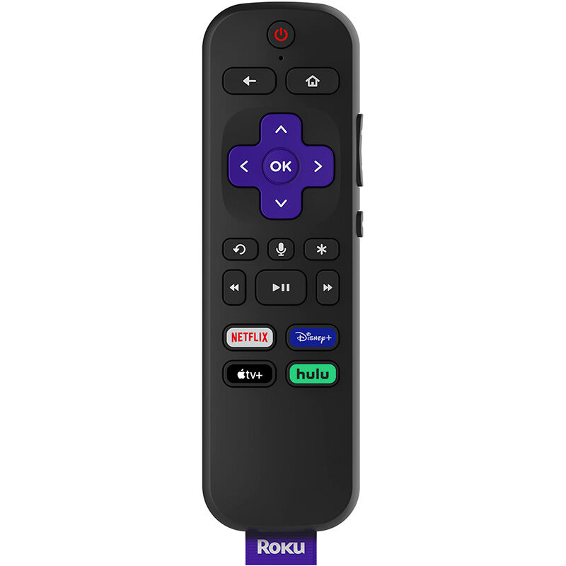

## Roku 4k Remote - User Experience Impression
#### By Sean O’Leary - 2/25/2022

[Back to Home](../)

I recently decided to upgrade my television streaming device from my 1st generation Amazon Fire Stick to the newest model of the Roku 4k streaming device based on recommendations. My initial impression besides an increase in experience quality due to new and faster hardware was the quality of the remote and its **usability**.

Initially, I found the remote to be really **effective** in conveying the functionality of the steaming device. The layout of the remote was familiar enough to the streaming device and cable tv remotes that I have used in the past so I found it particularly **learnable** right out of the box. I also noticed that the graphics for the buttons on the remote were very concise for the functionality of the mapping. The only exception to that was the star button which is the options button, or the “everything else button”. But besides the graphics there is also a physical texture to most all the buttons. For example the rewind, pause, and fast forward have the different shapes as well as concave and convex shapes to the top of the buttons that allow easy navigation in the dark and make the entire remote very **memorable** to the touch.

Another noteworthy observation for the remote was the placement of the buttons relative to the contouring of the remote. When grabbed loosely, there is an indent in the back of the remote that a user's index finger slides into easily and allows easy thumb access to all the face buttons. The placement of the volume and mute buttons on the side lends itself **efficiently** to the quick action of grabbing the remote and squeezing the side with either the index finger or thumb finger and operating the volume. 

Overall I found it to be a really pleasant experience to use the remote and the improvements over the remote for the 1st generation fire stick. As a user who usually does read the user manual when getting a new product to understand how everything is used, I found the **usefulness** and **learnability** to be a textbook as I didn’t have to use the manual at any point in the process of using the Roku 4k remote.

[Back to Home](../)
