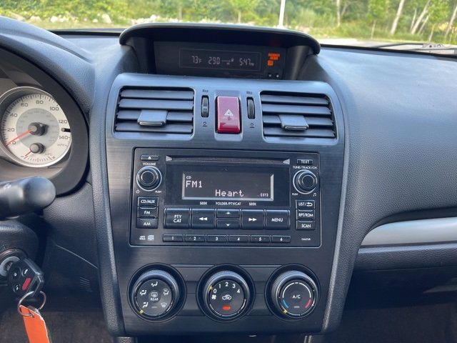

## 2013 Subaru Audio Dashboard - User Experience Impression
#### By Sean O’Leary - 5/15/2022

[Back to Home](../)

I have found my experience with the radio system for my 2013 Subaru impreza to be fairly consistent with most stock and basic(non touchscreen) radio systems in cars to date. It possesses all the necessary features for base radio operation and good labeling for the buttons so as not to confuse the user. But I wanted to mention one of the worst expereinces I have had in recent history with a product expereince and as its something I use often it continues to glare at me. 

The bluetooth setting up for this car is so terrible. Not only does it take a while to set up every time I want to change a bluetooth device as it only has the memory for one, but it makes me go through a process that took me a month to get replicable when learning how to to do it.

The process is detailed below:
temp.

[Back to Home](../)
